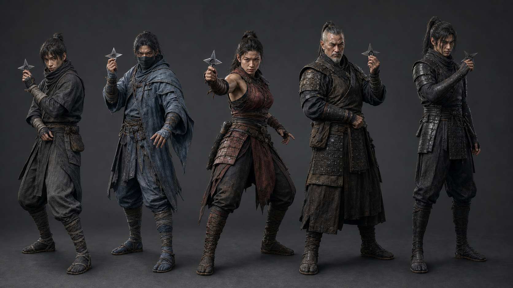

# SHINOBI ZERO キャラクターバイブル v1

この画像は外見と素材の方向を固定するコンセプト資料です。史実再現を断定する資料ではありません。3D制作では、実物資料を別途確認し、危険な武器の扱いを娯楽作品として明示します。

## 共通ルール

- 全員成人。流血や暗殺ではなく、手裏剣ダーツ競技の対戦者として描く
- 顔、体格、姿勢、装束の外周だけで誰か判別できるようにする
- 黒一色で潰さず、布、革、鉄、縄の粗さを光で読ませる
- 手裏剣の軌道は超能力で補正しない
- 装束の揺れは投擲の速度を見せるために使い、過剰に翻さない

## カゲロウ — 見習い

- 役割：最初の対戦相手、チュートリアル
- 体格：細身、若い。重心が少し高い
- 装束：軽い炭色の布、簡素な手甲、装備は最小限
- 投げ方：肘が先に出やすく、リリースが一定しない
- 戦術：19のシングルを中心に安全策を選ぶ
- 心理：残り60以下で精度が落ちる
- 専用演出：投げた後に半歩踏み直す

## シグレ — 下忍

- 役割：基本精度を試す二人目
- 体格：長身寄り、軽量
- 装束：雨を流す青灰色の外套、半面
- 投げ方：滑らかな横回転。動きは速いが手首が流れる
- 戦術：20中心。無理なチェックアウトは避ける
- 心理：連続命中で安定し、ミス後にわずかに崩れる
- 専用演出：外套の裾が遅れて追従する

## ヤシャ — 中忍

- 役割：初めて明確な圧力をかける攻撃型
- 体格：筋力のある女性。前脚へ強く乗る
- 装束：鈍い赤褐色の札と軽装、投げ腕を動かしやすくする
- 投げ方：腰の回転が大きく、リリース速度が高い
- 戦術：トリプル優先。得点は伸びるが散らばりも残る
- 心理：相手が高得点を出すと攻撃性が上がる
- 専用演出：命中後も的から視線を外さない

## ゲンマ — 上忍

- 役割：チェックアウト知識を問う戦術型
- 体格：幅広く、年長。低い重心
- 装束：黒褐色の古い具足、使い込まれた手甲
- 投げ方：予備動作を抑え、腰から静かに加速する
- 戦術：三投先の残りを考え、次に偶数を残す
- 心理：終盤ほど精度が上がる
- 専用演出：次の手裏剣を構えるまでの動作が短い

## ムクロ — 影

- 役割：最終対戦相手
- 体格：背が高く、無駄のない筋肉
- 装束：体に沿う黒布と小さな鉄板。左右非対称の継ぎ目
- 投げ方：構えからリリースまで軸がほぼ動かない
- 戦術：ダブルアウトと三投構成を高精度で選ぶ
- 心理：プレッシャー補正をほぼ受けない
- 専用演出：命中音の後まで残心を保つ

## 3D制作基準

- 顔：4Kテクスチャを基準。通常距離では毛穴より目線を優先
- 装束：身体1、頭部1、装備1の3マテリアルを基本とする
- 髪：カード方式。モバイルは段階的に密度を落とす
- LOD0：10万〜14万三角形、LOD1：6万、LOD2：2.5万を目安
- Steam DeckとiPhoneでは同時表示2人を基準にGPU負荷を測る
- 手と手裏剣の接触位置は全キャラクターで個別調整する

## 権利と販売

- コンセプト画像は制作方向の参考。最終モデルは新規に制作する
- 実在する家紋、俳優の容姿、既存作品固有の装束を模倣しない
- Steamストア画像とApp Store画像には実ゲーム画面を明記し、コンセプト画像を混同させない
