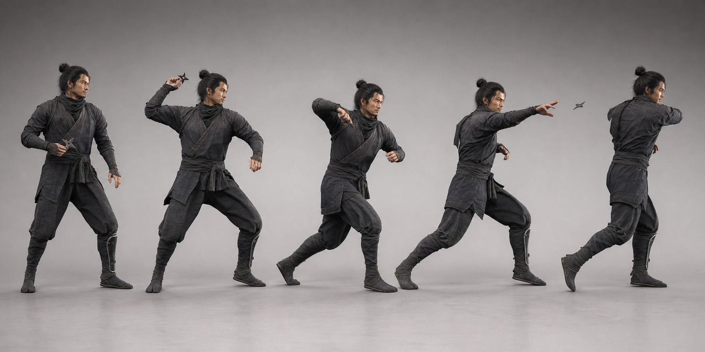

# 投擲モーション仕様 v1

## 原則

投擲は腕だけのアニメーションにしない。後脚の押し、骨盤、胸郭、肩、肘、手首の順で力を伝える。手裏剣はAnimation Eventで指から切り離し、その瞬間からRigidbodyへ制御を渡す。

## 基準クリップ

| 区間 | 正規化時間 | 動き |
|---|---:|---|
| 構え | 0.00–0.18 | 後脚へ55%荷重。視線を的へ固定 |
| 溜め | 0.18–0.38 | 骨盤を8–12度戻し、肩を遅らせる |
| 加速 | 0.38–0.61 | 後脚、骨盤、胸郭、肘の順で前へ出す |
| リリース | 0.61–0.66 | 手首を返し、`ReleaseShuriken`イベントを発火 |
| 残心 | 0.66–1.00 | 前脚で受け、視線を命中点へ残す |

## Unity実装

- Humanoid Rigを使い、Root Motionは対戦位置から動かない範囲だけ適用
- `NinjaThrowAnimator.PlayThrow()`で投擲ステートへ遷移
- Animation Eventから`NinjaThrowAnimator.ReleaseShuriken()`を呼ぶ
- `MatchCoordinator`はイベントを受けて手裏剣を生成する
- リリース前は手裏剣を右手のソケットへ固定する
- IKで視線と投げ腕の最終方向を盤面座標へ合わせる
- 入力精度をIKで補正しすぎない。最大補正角は肩6度、手首9度
- スワイプ距離はピクセル値ではなく画面幅・画面高に対する比率へ正規化する
- 標準リリースは画面高の34%。遅いドラッグや1.4秒を超える入力は投擲にしない

## キャラクター差

| 忍者 | リリース | 腰の先行 | 残心 | 特徴 |
|---|---:|---:|---:|---|
| カゲロウ | 0.64 | 0.06秒 | 短い | 肘が早く、踏み直す |
| シグレ | 0.60 | 0.09秒 | 中 | 外套が遅れて流れる |
| ヤシャ | 0.58 | 0.12秒 | 長い | 前脚へ強く乗る |
| ゲンマ | 0.66 | 0.14秒 | 中 | 予備動作が小さい |
| ムクロ | 0.63 | 0.16秒 | 長い | 頭と軸が動かない |

## 品質確認

- 30fpsのコマ送りでも手裏剣が指へ食い込まない
- リリース前にRigidbodyが有効にならない
- 左右反転版で装具や布が身体へ貫通しない
- 60fpsと120fpsで命中座標が変わらない
- モバイルの低品質設定でもリリースフレームを維持する
- 投擲中にポーズ、アプリ中断、Steam Overlayを開いても二重投擲しない
